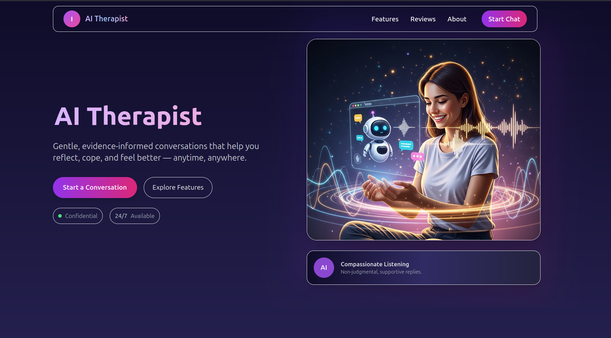

# 🧠 AI Therapist

*Empathetic AI companion for voice and text conversations — private, session-based, and reflective.*

---

  
[🌐 Live Demo](https://ai-therapistt.netlify.app/)

## 🌟 Overview

AI Therapist is an **interactive web application** that allows users to communicate with an AI in **text or voice**. It provides **empathetic, reflective dialogue** while maintaining **session-based privacy**.  

**Key Highlights:**
- Two modes: **Normal Mode**(still working on it) and **Anonymous Mode** (quick, private access).  
- Conversations are **cached temporarily in session storage** and destroyed after the session.  
- Supports **voice input/output** and **text chat**.  
- Built with **React Vite frontend**, **FastAPI backend**, using **GPT-OSS-20B** and **Sarvami AI API** for conversational intelligence.

---

## ✨ Key Features

- **Two Modes of Use**  
  - **Chat / Voice:** Communicate naturally with AI via text or speech.  
  - **Landing Pages:** Welcome page for app overview and mode selection.  

- **Privacy & Session Handling**  
  - Conversations stored temporarily in session cache.  
  - Data is destroyed when the session ends.  

- **Empathetic AI Interaction**  
  - Reflective and supportive responses (not professional therapy).  
  - Crisis detection with alerts encouraging users to seek help.

---

## 🏗️ Tech Stack

- **Frontend:** React (Vite) + Tailwind CSS  
- **Backend:** FastAPI  
- **AI Model:** GPT-OSS-20B  
- **API:** Sarvami AI API Key for voice   
- **Data Handling:** Session storage / cache (no persistent data in Anonymous Mode)

---

## ⚙️ Installation & Setup

Basic setup instructions:  

```bash
# Clone the repo
git clone <your-repo-link>
cd ai-therapist

  For full **frontend** and **backend** installation steps, environment variables, and configuration, please check the respective READMEs:

  - [frontend/README.md](frontend/README.md)  
  - [backend/README.md](backend/README.md)  

---

## 👥 Contributing

We welcome contributors!

**Suggested guidelines for now:**

1. Fork the repository and create a branch for your feature/fix.  
2. Submit a pull request with a clear description of changes.  
3. Keep code style consistent with existing code.  

> Note: You can create a proper `CONTRIBUTING.md` file later with detailed rules.

---

## 📜 License

Currently **not licensed**.


